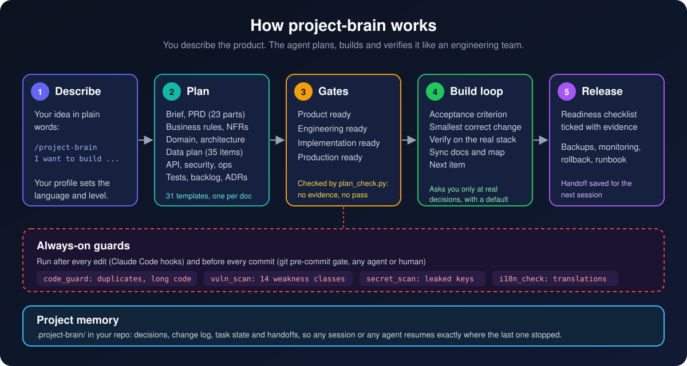
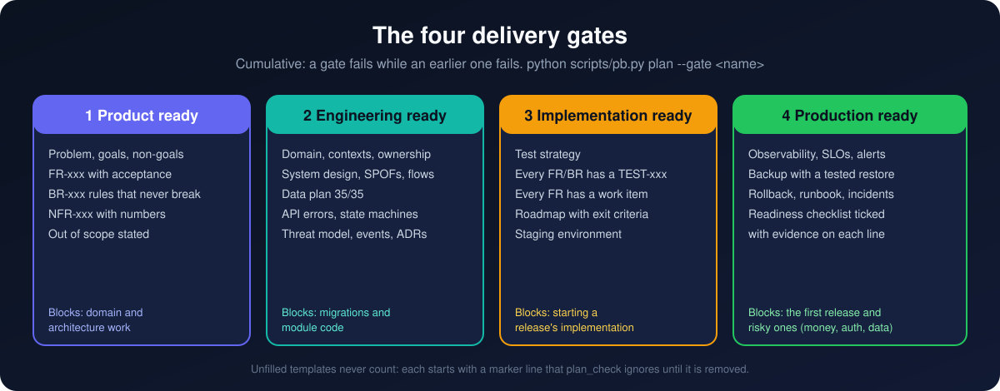
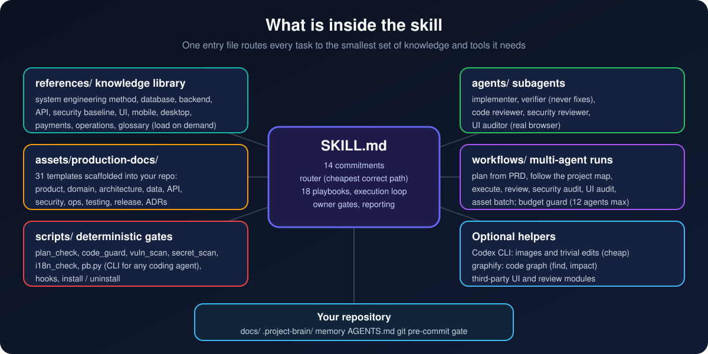

<p align="center">
  
</p>

<h1 align="center">project-brain</h1>

<p align="center">
  <b>Vibe coding with an engineering team's discipline.</b><br>
  You describe the product. The agent plans it, builds it in small verified steps, and refuses to skip the checks beginners usually skip.
</p>

<p align="center">
  <a href="LICENSE"></a>
  
  
  
</p>

---

## The problem

AI agents write code fast, and that is exactly the problem. Left alone they:

- start from tables and pages instead of the product and its rules,
- invent requirements nobody asked for,
- copy the same function into three files and write 500-line components,
- forget authorization, input validation and secrets,
- say "done" without running anything.

**project-brain** is a [Claude Code](https://claude.com/claude-code) skill that gives the agent the method a professional software studio follows, and **checks it with deterministic scripts instead of promises**. The scripts are plain Python, so Codex CLI, Cursor, Gemini CLI and Aider can use them too: the agent-neutral rules are written into your repo's `AGENTS.md` / `GEMINI.md`.

## How it works

<p align="center"></p>

1. **Describe** your idea in plain words: `/project-brain I want to build ...`
2. **Plan.** The agent scaffolds a docs pack and fills it: product brief, PRD, business rules, measurable NFRs, domain model, system design, a 35-item data plan, API contracts, security, operations, tests, backlog and ADRs.
3. **Gates.** `plan_check.py` decides when the plan is complete enough for the next phase. Nothing passes without the documents and IDs that prove it.
4. **Build loop.** For each item: acceptance criterion first, the smallest correct change, verification on the real stack, then the docs and the project map are updated. You are asked only about decisions that are really yours, each with a recommended default.
5. **Release** only when the readiness checklist is ticked with evidence on each line.

## Plan the system before the code

<p align="center"></p>

`python scripts/pb.py scaffold-docs --root .` adds **31 templates** to `docs/` without overwriting anything you already have:

| Area | Documents |
|---|---|
| Product | Product brief, PRD (23 sections: WHAT and WHY, never HOW), business rules, non-functional requirements, roadmap |
| Domain | Domain model, bounded contexts with data ownership, state machines |
| Architecture | System context, system design, architecture, backend architecture, deployment |
| Data | Data architecture (conceptual, logical and physical model, 35-item gate, data dictionary), retention policy |
| API | API contracts with a stable error taxonomy, events and queues, webhooks |
| Interfaces | One spec per application (web, mobile, admin, POS) |
| Security | Threat model, authorization matrix, a walk through 14 weakness classes |
| Operations | Observability, backup and recovery, incident response, runbook, CI/CD |
| Testing and delivery | Test strategy, Gherkin acceptance tests, backlog / WBS, production readiness checklist, ADRs |

`PROJECT_MAP.md` is the index: what exists, where, why, how it connects, and its status. It also holds a **traceability table** linking each requirement to its business rule, API, code, table, event, test and work item.

## Four gates

<p align="center"></p>

```bash
python ~/.claude/skills/project-brain/scripts/pb.py plan --root . --gate engineering
```

Each template starts with a marker line that the checker ignores until you remove it, so **an empty template can never pass a gate**. A ticked readiness item without `evidence:` on its line counts as open.

## Guards that run on every change

<p align="center"></p>

| Guard | Catches |
|---|---|
| `code_guard.py` | Duplicate files, duplicate function bodies, renamed copies, over-long functions and files |
| `vuln_scan.py` | 14 weakness classes, e.g. SQL and command injection, XSS, missing authorization, mass assignment, weak hashing, open CORS, external calls without a timeout |
| `secret_scan.py` | API keys, tokens, private keys and passwords about to be committed |
| `i18n_check.py` | Missing translation keys and files, placeholder mismatches |

In Claude Code they run after every edit (hooks). For every agent and human they run in the git **pre-commit gate** that `pb.py start` installs.

## What is inside

<p align="center"></p>

- **`SKILL.md`**: 14 commitments, a router to the cheapest correct tool, 18 playbooks (new project, feature, bug, database, API, multi-interface products, UI, security review, deploy, incidents...), the execution loop and the owner gates.
- **`references/`**: the knowledge library, loaded on demand. It covers the system engineering method, database design, backend and API design, a security baseline, frontend without "AI slop", Flutter, Electron, payments and privacy, operations, and a glossary for beginners.
- **`agents/`**: Claude Code subagents.
  - implementer;
  - verifier, which never fixes, only proves;
  - code reviewer;
  - security reviewer;
  - UI auditor, which works in a real browser.
- **`workflows/`**: multi-agent runs with a budget guard (12 agents by default).
  - plan a project from a PRD;
  - follow the project map section by section;
  - review changes;
  - audit security;
  - audit the UI;
  - generate image assets.
- **`.project-brain/`** (created in your repo): decisions, change log, task state and handoffs, so the next session resumes exactly where the last one stopped.

## Quick start

**Requirements:** Claude Code, Python 3.10+, git.
**Optional:** Node (workflow syntax test), [graphify](https://pypi.org/project/graphifyy/) (`pip install graphifyy`, code graph), and Codex CLI (cheap image generation and trivial edits).

```bash
git clone https://github.com/escanoreb22/project-brain ~/.claude/skills/project-brain
python ~/.claude/skills/project-brain/scripts/install.py
```

`install.py` does the following:
- writes this machine's paths into the workflows;
- installs the `pb-*` subagents into `~/.claude/agents`;
- registers the optional Codex MCP server;
- adds the project-brain hooks to `~/.claude/settings.json`, after writing a backup (your other hooks stay);
- runs the test suite.

To remove everything it added:

```bash
python ~/.claude/skills/project-brain/scripts/install.py --uninstall
```

Then fill in `references/owner-profile.md` once. It sets your language, your experience level and your usual stack. A *beginner* level makes the agent explain terms in plain words.

## Your first project

In an empty folder, start Claude Code and type:

```text
/project-brain I want to build <your idea in two sentences>
```

Useful at any time:

```text
/project-brain where are we?          # status, open decisions, next action
/project-brain review my last changes # independent review of the change set
/project-brain is it ready to ship?   # production gate with evidence
```

## Honest limits

- **Tested on:** Windows 10 with Claude Code. The scripts are plain Python and should work on macOS and Linux, but that is not tested yet. Reports are welcome.
- **What the gates check:** they prove that the right documents and IDs **exist**. They cannot judge whether a decision is good, so read what the agent writes.
- **Defaults are opinionated:** Laravel, MySQL 8.4, React/Inertia and Apple HIG. Change them in `references/owner-profile.md`.
- **Workflows spend many tokens.** Start with the single-agent playbooks.
- **Optional third-party modules are not included,** because of their licenses. See [`modules/README.md`](modules/README.md) for where to get them.

## Contributing

Issues and pull requests are welcome. Run the tests before opening a PR:

```bash
python -m unittest discover -s tests
```

## License

[MIT](LICENSE) © 2026 escanore.b.22. Optional modules keep their own licenses.

<sub>Illustrations generated with Codex CLI through project-brain's own asset playbook. Diagrams are hand-written SVG.</sub>
