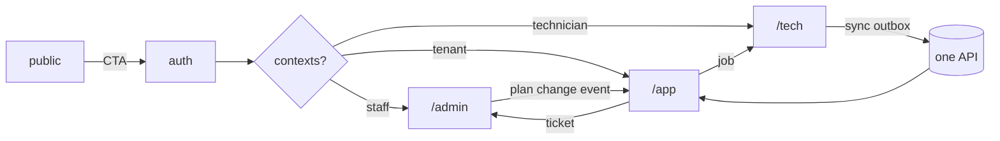

# Multi-surface architecture (several interfaces, one product)

Scope: how to split, connect and keep consistent products with more than one interface (e.g. public site + auth + `/admin` platform + `/app` tenant workspace + `/tech` field PWA; or web merchant + platform + Electron POS + Flutter mobile). Backend layering, schema, API shape and UI tokens live in `backend-architecture.md`, `db-schema-design.md`, `api-design.md`, `frontend-system-design.md`; threat controls in `security-protocol.md`. This file covers the seams between surfaces.

Sources: (Evans, DDD, strategic design: bounded contexts); (Newman) BFF pattern https://samnewman.io/patterns/architectural/bff/ ; (Mezzalira, Building Micro-Frontends, intro chapters: cost of splitting); (Kleppmann, DDIA, ch. 5 replication, ch. 11 stream/event processing); (Kleppmann et al., "Local-first software", 2019) https://www.inkandswitch.com/essay/local-first/ ; OWASP ASVS 5.0 V8 Authorization https://cornucopia.owasp.org/taxonomy/asvs-5.0/08-authorization/02-general-authorization-design ; Laravel Sanctum / Authentication / Routing docs (12.x); Inertia server-side setup https://inertiajs.com/server-side-setup ; MDN Background Sync API.

## 0. Verified facts (checked Oct 2026)

- ASVS 5.0 V8 (Authorization): V8.2.1 function-level access needs explicit permission; V8.2.2 data-level (anti-IDOR); V8.2.3 field-level (L2+); V8.2.4 adaptive/contextual controls (L3). Cite as "ASVS 5.0 V8.2.x"; confirm the project's pinned ASVS version in `SECURITY_PROFILE.yaml`.
- Sanctum has two modes: cookie-session SPA auth (uses the `web` guard, needs same top-level domain, `statefulApi()` in `bootstrap/app.php`, `/sanctum/csrf-cookie`) and bearer API tokens (SHA-256 hashed, abilities, never expire by default; set `expiration`). Docs say: do not use API tokens for your own first-party SPA. `tokenCan()` always returns true for first-party cookie requests, so a policy must still check the user.
- Inertia: root template is `resources/views/app.blade.php`; `Inertia::setRootView('name')` switches it. Blade `<x-inertia::head />` + `<x-inertia::app />` are the current components.
- Laravel guest/auth redirects: `$middleware->redirectGuestsTo(...)` and `$middleware->redirectUsersTo(...)` in `bootstrap/app.php` (closures allowed).
- Background Sync API is not Baseline (limited browser support per MDN). Never make it the only sync path; always sync on app start, on reconnect event and on a manual "Sync now".

## 1. Do you need another surface or app at all? (Mezzalira, Newman)

- Default: ONE Laravel app, ONE React build with route-level code splitting, ONE API, surfaces separated by route prefix + layout + middleware. Reason: a solo founder pays every extra deploy, build, auth flow and cache layer.
- A new surface needs: a distinct actor, a distinct device/context, or a distinct trust level. Different screens for the same actor is a module, not a surface.
- Split into a separate deployable/frontend only when ALL hold: independent release cadence is a measured need; a different runtime is forced (Electron, Flutter, native); a stable API contract exists. Micro-frontends (runtime composition of independently deployed UIs) are almost never justified for one developer (Mezzalira).
- BFF (Newman): add a surface-specific backend layer only when a client needs different aggregation/shape that makes the shared API awkward (typical: POS offline bundle, mobile payload size). Default: one API; shared resources stay at `/api/v1/<resource>`, and only endpoints with no shared equivalent (POS bootstrap bundle, batch sync) live under the surface (`/api/v1/pos/*`). Never fork an existing resource per client (`api-design.md` sec. 2). One BFF per experience, not per team. Shared logic stays in Actions; BFF controllers only compose and shape.

## 2. Surface inventory (do this before any route)

Write `docs/SURFACE_MAP.md` (template in section 13). One row per surface:

| Field | Question |
|---|---|
| id, name | `public`, `auth`, `admin`, `app`, `tech`, `pos`, `mobile` |
| actor | who (platform staff, tenant owner, cashier, technician, anonymous) |
| device | desktop browser, phone browser/PWA, Electron, Flutter |
| auth method | session cookie, Sanctum bearer + device binding, none |
| entry URL | path prefix (default) or host (needs justification) |
| offline | none / read-only cache / full offline with sync |
| locales + dir | ar/fr/en, RTL yes/no |
| layout + shell | one named layout component |
| owner module(s) | which backend modules it reads/writes |

Rule: no route, folder or host is created for a surface that is not in the map and in the PRD/owner request.

## 3. Prefixes vs subdomains

- Default: one domain, prefixes: `/` public, `/login` auth, `/admin/*` platform, `/app/*` tenant, `/tech/*` field PWA, `/api/*` API. Same cookie, same CSP, same TLS cert, no CORS, no cross-subdomain cookie config.
- A subdomain needs a written reason in `DECISIONS.md`, one of: separate cookie/trust isolation required by the threat model (e.g. user-generated HTML), per-tenant vanity hosts that the PRD requires, separate deployable. "Looks cleaner" is not a reason. The owner was angry when unrequested hosts (`ad.`, `device.`, `hooks.`, `files.`) were added: never add a host, DNS record, Cloudflare rule or vhost that the owner or PRD did not name.
- Laravel: prefix group `Route::prefix('admin')->name('admin.')->middleware([...])->group(...)`; host group `Route::domain('{tenant}.example.com')` only when justified. Keep one route file per surface (`routes/admin.php`, `routes/app.php`, `routes/tech.php`) loaded in `bootstrap/app.php`.
- Locale routing for public SEO pages: `/`, `/fr`, `/ar`. Authenticated surfaces use the user's locale setting, not a URL prefix, unless the PRD says otherwise.
- Check: `php artisan route:list` grouped by prefix must match `SURFACE_MAP.md` exactly; any extra prefix or host is drift.

## 4. Identity model: one identity, many principals

- Default: ONE `users` row per human; roles/memberships are separate rows: platform role (`platform_staff`), tenant membership (`tenant_user` with role), device/technician profile. A human who is staff and a tenant owner has one login and a context selector.
- Do not create a table per actor type for login (admins, merchants, techs as separate user tables) unless credentials, lifecycle and compliance truly differ. Multi-guard (`auth.guards` in `config/auth.php`) only when the sessions must be isolated (e.g. platform admin session must not share a cookie with tenant sessions); record the reason.
- After login: resolve contexts. 0 contexts -> onboarding or "no access" page; 1 -> redirect straight to its home; >1 -> context selector (remember last choice server-side). Store the active context in the session, never trust a client-sent `tenant_id`.
- Redirect authenticated users away from auth pages (`guest` middleware + `redirectUsersTo` closure that computes the right home per context). Unauthenticated users hitting a surface go to login with an intended-URL return that is validated to a same-origin path.
- Context switch re-authorizes: regenerate session or at least flush cached permissions; clear tenant-scoped client caches (React Query, Zustand, Inertia history).
- Sensitive actions (billing, deleting a workspace, changing owner): `password.confirm` middleware or step-up. `Auth::logoutOtherDevices()` on password change.
- Devices (POS, mobile, tech PWA): Sanctum bearer token per device with abilities (`pos:sync`, `orders:create`), device name, last-used, remote revoke from the web UI, expiry set explicitly. Browser surfaces: cookie session. Do not issue bearer tokens to the first-party web app.

## 5. Authorization matrix (role x surface x action)

- Write `docs/AUTHZ_MATRIX.md`: rows = permissions/actions, columns = roles, plus a column per surface where it is reachable. Cells: allow, deny, own-only, tenant-scoped. Source of truth for both policies and UI visibility.
- Enforce at four layers (ASVS 5.0 V8.2.1-V8.2.3): (1) surface middleware (e.g. `can:access-admin`), (2) route/controller `authorize()` / Policy per model, (3) query scoping (global tenant scope + `tenant_id`), (4) field-level via API Resources. UI hiding is a convenience, never a control.
- Automated test, mandatory: a Pest dataset generated from the matrix: for each (role, surface, action) assert the expected status (200/302/403/404). Include: cross-tenant ID returns 404 (never 403; same rule as `api-design.md` and `backend-architecture.md`), staff role on tenant surface, tenant user on `/admin`, anonymous on every prefix, revoked device token.
- Test also that each surface's JSON/props never leak fields of another actor (e.g. internal notes, cost price, other tenants' counts) with a snapshot of the Resource keys.
- Default deny: a new route without a policy fails an architecture test (every route under `admin|app|tech|api` has `auth` + an authorize call or named policy middleware).

## 6. Shared kernel vs surface-specific code

Shared (one place, imported by all web surfaces): design tokens + CSS variables, UI primitives (Button, Input, Dialog, Table, Toast), form/validation helpers, API client (typed, one error handler for 401/403/419/422/429/5xx), i18n loader + formatters (money, date, numbers, Arabic digits policy), RTL utilities, permission hook `useCan()`, icon family, error-page components.
Surface-specific: layouts/shells, navigation config, page components, surface-only widgets, copy.
Rules:
- Shared code never imports from a surface. Surfaces never import from each other (lint rule `no-restricted-imports` or dependency-cruiser). If two surfaces need the same component, promote it to `shared/` in the same change.
- Promote on second real use, not before (see `engineering-principles.md`). A "shared" folder of one-use components is speculative.
- Flutter and Electron cannot import web components: share through contracts, not code: tokens exported as JSON from one `design-tokens.json` consumed by CSS and Flutter `ThemeData`; OpenAPI-generated clients; one translation source (JSON/ARB generated from the same keys).

## 7. Frontend structure per surface

Existing repo layout wins; never move an existing app into this tree without an owner decision. For a new multi-surface app:

```text
resources/js/
  shared/{ui,api,i18n,auth,hooks,errors,tokens}/   # ui = the primitives of frontend-system-design.md sec. 4
  public/{layouts,pages,components}/
  auth/{layouts,pages}/
  admin/{layouts,pages,components}/  admin/nav.ts
  app/{layouts,pages,components}/    app/nav.ts
  tech/{layouts,pages,offline}/
  app.tsx            # Inertia resolver: maps "Admin/Orders/Index" -> admin/pages/Orders/Index.tsx
  ssr.tsx
```
- Inertia: pages resolved by name `Admin/Orders/Index`, `App/Orders/Index`; one `resolve` using `import.meta.glob` per surface so each surface chunk loads on demand (public never downloads admin code). Layout assigned per page via persistent layouts, chosen by the surface folder.
- Root view: default one `app.blade.php`. Use `Inertia::setRootView()` in a surface middleware only when a surface needs a different `<head>`, manifest or no SSR (e.g. `/tech` PWA with its own manifest and service worker scope). Do not create a root view per surface "for cleanliness".
- SSR only for surfaces that need SEO or first-paint (public, maybe auth). `/admin`, `/app`, `/tech` can opt out; record which in `SURFACE_MAP.md`. Restart the SSR process after each build.
- Each surface has its own navigation config (`nav.ts`) filtered by `useCan()`; sidebar items for routes the user cannot open must not render.
- Visual identity: one design system; surfaces differ by density and shell, not by palette. Platform admin may carry a small badge/color strip so staff always know which context they are in.

## 8. Backend boundaries

- One API under `/api/v1`, surface-specific controllers only where shape differs (`Http/Controllers/Admin`, `.../App`, `.../Tech`). Both call the same Action; never duplicate business rules per surface.
- Surface-specific middleware stack per route file: `admin` (staff role, optional IP allow-list/2FA, stricter rate limit), `app` (tenant resolved, workspace state check), `tech` (device/technician context, offline-friendly cache headers).
- Tenancy resolution happens once in middleware and binds `CurrentTenant`; surfaces read it, never recompute it.
- Impersonation ("log in as tenant") belongs to `admin`, creates an audit row, shows a persistent banner on `/app`, blocks sensitive actions (password change, billing), and has a hard time limit.

## 9. Cross-surface flows (both ends or it is not done)

For every feature, answer: "who initiates, who responds, who is notified, who audits?" Each answer must have a screen or endpoint on the right surface.
- Pairs to check by default: support ticket (tenant creates on `/app`, staff answers on `/admin`, tenant sees reply + notification); plan/price/limit edit on `/admin` reflects on `/app` (limits, billing page, upgrade prompts); tenant suspension on `/admin` -> lock state on `/app`; technician job assigned on `/app` or `/admin` -> appears on `/tech` -> completion returns status + photos; POS sale -> ledger/stock/report on `/app`; invoice issued -> customer portal/PDF/email.
- Implement the connection through domain events (`TicketReplied`, `PlanChanged`, `WorkspaceLocked`), listeners that write notifications, and a read path. Do not make surface A call surface B's controller.
- Notification path: event -> queued listener -> `notifications` row (in-app) -> optional mail/push -> UI badge. Realtime: default is polling (30-60 s, or on window focus) via the same API; add Reverb/websockets only when the PRD demands live updates, then still keep polling as fallback. Cache-bust per tenant on change.
- Record each pair in the SURFACE MAP "Flows" table and in `[SYSTEM_FLOW]`; a half-built pair goes into `[ORPHANS & PENDING]` immediately.
- Event payloads carry ids and versions, not models; consumers are idempotent (processed-event key) because queues retry (see `backend-architecture.md` sec. 5-6).

## 10. Offline-first device surfaces (POS, field PWA, mobile)

Apply when the surface must work without network (Kleppmann et al.: network independence, responsiveness; DDIA: replication lag and conflicts are normal).
- Local store: SQLite on Electron/Flutter, IndexedDB on PWA. The server is the system of record; the device holds a scoped replica (this tenant, this branch, this day's catalog) and an outbox.
- Data down: versioned bundle per resource (`/api/v1/pos/bootstrap?since=<cursor>`), cursor-based delta, deletions as tombstones. Prices, tax, stock snapshots are stamped with a version; a sale stores the version it used.
- Data up (outbox): every write is a command with a client-generated UUID (`client_uuid`), `device_id`, `created_at_device`, schema version. Server endpoint: `POST /api/v1/pos/sync` accepts a batch, returns a PER-ITEM result (`applied | duplicate | rejected(reason) | conflict`). The client deletes only items the server acknowledged; rejected items go to a visible "needs attention" list, never silently dropped.
- Idempotency: unique index `(tenant_id, device_id, client_uuid)`; replaying a batch returns the original result. Never rely on request-level retry alone.
- Conflict rules, decided per entity and written in the doc: append-only facts (sales, payments, stock movements) never conflict, they accumulate; mutable master data (customers, prices) is server-wins with the device notified; counters/sequences (invoice numbers) are allocated server-side in ranges per device or assigned on sync with a local provisional number. No last-write-wins on money.
- Clock: device time is advisory; server stamps `received_at`. Detect skew > N minutes and warn.
- UI states required: online, offline, syncing (n pending), sync error (n failed), last sync time, stale-data warning, blocked-by-update.
- Security: encrypt local DB or limit data scope, device token with abilities, remote revoke wipes on next contact, no secrets in the bundle, lock screen after idle.
- Test: kill the network mid-batch, replay the same batch twice, sync two devices selling the same last stock, sync after an API deploy. All must end consistent.
- Service-worker Background Sync is optional sugar (limited support); the sync loop must also run on start, reconnect and manual trigger.

## 11. Versioning between clients and API; navigation contracts

- Desktop/mobile clients update slower than the server. Send `X-Client: pos/2.3.1` on every request (the API version is already in the `/api/v1` path). Server keeps `min_client_version` per surface in config and exposes it at `GET /api/v1/meta`. Below minimum: respond `400` problem+json with `code: client_outdated` and `update_url` (not 426: RFC 9110 reserves 426 for protocol upgrades and requires an `Upgrade` header); client shows a blocking update screen but keeps the outbox safe and still syncs if the sync contract is unchanged.
- Within `/api/v1` only additive changes (see `api-design.md`); sync payloads carry `schema_version` and the server accepts N and N-1 for at least one release cycle. Removing a field needs a deprecation window recorded in DECISIONS.md.
- Navigation contract: every cross-surface link uses a named route or a stable URL listed in `SURFACE_MAP.md` (`/app/tickets/{id}`, `/admin/tenants/{id}`). Emails, notifications, push payloads and QR codes use these. Deep links resolve through auth: unauthenticated -> login -> return to the same URL; wrong context -> context selector -> return; no permission -> 403 page of the target surface, not a redirect loop.
- Mobile/desktop deep links: custom scheme or universal link maps to the same path set; unknown path opens home, never a crash.
- Never change a published URL without a 301/redirect entry and a map update.

## 12. Per-surface errors, onboarding, lock states

- Error pages, one component set in `shared/errors`, styled per surface shell, localized, RTL-correct: 403 (say what role is needed, link to switch context), 404, 419 (session expired: preserve form data, re-login, return), 429 (show retry time), 500/503 (request id, retry), maintenance (503 + `Retry-After`, per-surface: public shows status, admin may bypass by secret/IP). Inertia: handle `403/404/419/429/5xx` in `bootstrap/app.php` `withExceptions` and render the error page of the surface matching the path prefix.
- API clients (POS/mobile) get problem+json, never HTML error pages.
- Onboarding per surface and per actor: tenant owner (workspace setup, first data, invite team), invited user (accept invite, set password, land in the right context), technician (install PWA, permissions, first job), cashier (device activation, first sync). Each has a checklist state stored server-side and a skip/resume path. Onboarding must not block a user who already completed it elsewhere.
- Tenancy lock states: define per state (trial_expired, past_due, suspended, cancelled, read_only) what each surface does. Lock behavior is billing behavior: owner gate; propose this default and wait. Default: tenant owner keeps a LOCKED WORKSPACE PREVIEW (data visible, writes blocked, banner + one CTA to fix billing, export allowed); team members see read-only plus "ask the owner"; device surfaces keep syncing already-queued sales but block new ones per policy; platform staff always access via `/admin`. Redirect-only lock (to a billing page) is allowed only if the PRD says so. Enforce server-side (middleware `workspace.active` + policy), UI is a mirror.

## 13. SURFACE MAP template (`docs/SURFACE_MAP.md`)

```markdown
| id | actor | device | auth | entry | offline | SSR | locales | layout |
|---|---|---|---|---|---|---|---|---|
| public | visitor | any | none | / , /fr, /ar | no | yes | ar fr en | PublicLayout |
| auth | any | any | session | /login | no | yes | ar fr en | AuthLayout |
| admin | platform staff | desktop | session + 2FA | /admin | no | no | en fr | AdminLayout |
| app | tenant users | desktop+phone | session | /app | no | no | ar fr en | AppLayout |
| tech | technician | phone PWA | session | /tech | read cache + outbox | no | ar fr | TechLayout |

Flows (both ends mandatory):
| flow | initiator surface | responder surface | event | notification | status |
|---|---|---|---|---|---|
| support ticket | app | admin | TicketReplied | in-app + mail | wired / orphan |
```



## 14. Cross-surface consistency checklist (run before claiming ANY feature done)

1. Feature appears in `SURFACE_MAP.md` flows; both ends exist and were opened in the browser (initiator + responder, correct URLs).
2. `AUTHZ_MATRIX.md` row exists; generated authz test passes for all roles and surfaces; cross-tenant test passes.
3. Nav entry exists only where permitted; deep link from email/notification opens the right page via login and context selector.
4. Notification/event fires, queue worker processed it, badge/list updates (poll or realtime) on the other surface.
5. Same label, status names, colors, money/date format and translation key on every surface that shows the entity.
6. All locales (ar/fr/en) and RTL checked on each affected surface at desktop and phone width.
7. Error, empty, loading, denied, locked-workspace and offline states exist for the new screens.
8. Device clients: older client version still works or gets a clear update screen; sync replay is idempotent.
9. Route list, folder structure and hosts match the map; no new subdomain, prefix or service that the owner did not request.
10. Docs, project map `[ORPHANS & PENDING]`, change log and handoff updated.

## Red flags

- A subdomain, host, service or app added "for separation" without an owner request and a `DECISIONS.md` entry.
- Separate login tables/pages per actor with duplicated logic; or an authenticated user can still open `/login`.
- Tenant id, role or surface trusted from the client; policy missing on a new route; authorization only hidden in the UI.
- A feature exists on one surface only (ticket sendable but not answerable; plan editable but not reflected; job created but not visible on `/tech`).
- Surfaces importing each other's components; "shared" folder holding one-use code; hex colors or per-surface palettes.
- First-party SPA using bearer tokens in localStorage; device tokens that never expire or cannot be revoked.
- Offline client deleting local data before a per-item server ACK; sync endpoint that is not idempotent; last-write-wins on money or stock.
- No min-supported-client check; breaking API change while old POS builds are in the field.
- Generic error page or HTML error returned to API clients; locked workspace that simply 500s or loops redirects.
- Claiming done after checking one surface in one language.

## How project-brain uses this

- Load when: a project has more than one surface, a PRD lists several actors/devices, a task adds a route prefix/host/role/device, touches login redirects or context selection, or adds any cross-surface feature (support, plans, notifications, sync).
- Gates served: Architecture (boundaries, trust levels, deployment hosts), Design (surface/state inventory, error pages, onboarding), Security (authz matrix + tests, device tokens), Drift (map vs route list), Verification (section 14 before "done").
- Record: `docs/SURFACE_MAP.md` (surfaces + flows + mermaid), `docs/AUTHZ_MATRIX.md`, offline/sync contract in `docs/` (conflict rules per entity, `min_supported_client`), lock-state table; in `.project-brain/DECISIONS.md` each justified subdomain, guard choice, root-view/SSR choice, 404-vs-403 policy and any `delegated, open to reversal` default; unwired flow ends in `[ORPHANS & PENDING]`; tasks carry `invariants`: "no surface imports another surface", "every flow has both ends".
